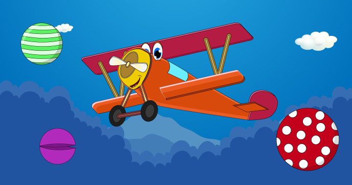

This fun game puts you in the pilot seat of a cute airplane. Your goal is to destroy all the objects that fly towards you. As soon as you finish destroying all the objects, the game advances to a new level with even more challenges.

While building this game you’ll learn:

-	How to create multi-scene / multi-level games
-	How to manipulate sprite objects
-	How to update and display several moving objects on the screen
 
## Source code 
The JavaScript source code of this program can be found [here](sketches/program.js). To run it, you need to import it in the [codeguppy.com](https://codeguppy.com) online editor. Alternatively, you can use the source code in your p5.js sketches (advanced use). 
## Online version 
To see the code running, check the online playground at [https://codeguppy.com/code.html?t=plane_objects](https://codeguppy.com/code.html?t=plane_objects) 
## Next steps 
Please check [codeguppy.com](https://codeguppy.com) for many other fun JavaScript programs and games for beginners. To stay up to date with CodeGuppy development please follow [@codeguppy](https://twitter.com/codeguppy) on Twitter.  
